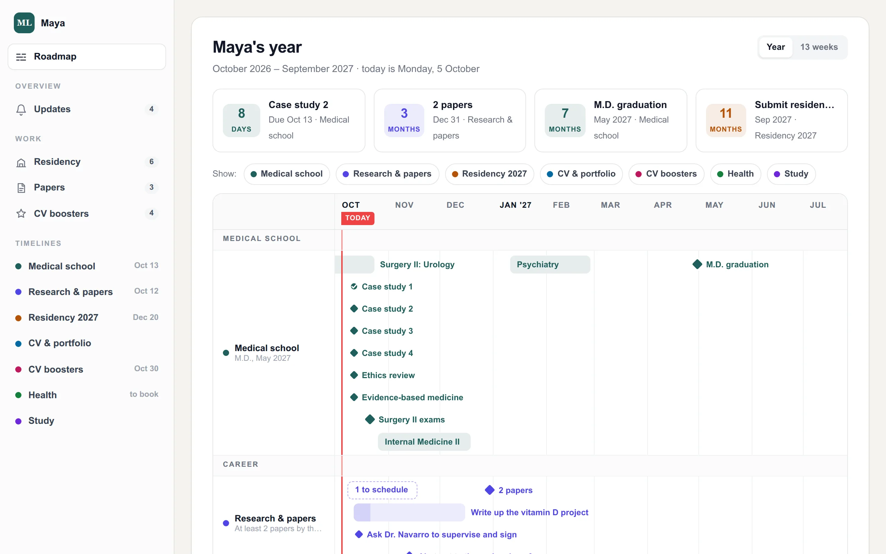

# What you get

A personal CRM is a place where one project of your life stops being scattered. Instead of
deadlines in your head, documents in five apps and a to-do list you forgot about, you get:

- **One spreadsheet** in your own Google Drive, holding every date, step and list. You can open
  and edit it like any spreadsheet.
- **A private dashboard**: a website only you can log into. It shows your whole project on one
  timeline, what is coming up next, and pages for the lists you compare (programs, bills, test
  results).
- **A public page and a CV**, if you want them. Made from the same spreadsheet, so they never
  go out of date.
- **A chat assistant that keeps it current.** You say "today I sent the application", and it
  updates the spreadsheet. The websites follow on their own.

You do not need to code. An AI agent does the building; you talk, choose and confirm.

## What it costs

| Thing | Cost |
|---|---|
| The kit (this guide, the agent skill, the apps) | free, open source (AGPL-3.0) |
| Google Drive | free (your existing Google account) |
| Hosting the websites on Cloudflare | free plan |
| A web address of your own (`yourname.com`) | optional, about 10-15 USD a year |
| An AI agent | whatever you already pay for it |

Your agent will always ask before anything that costs money.

## What you need

- An **AI agent that can run commands on a computer**: for example Claude Code or Codex. A
  plain chat window is not enough for the setup (it is enough afterwards, for daily updates).
- A **Google account**.
- About **two hours**, spread over a few days: one conversation, a few choices, two logins.
- Optional: a free **Cloudflare account**, to put the websites online.

> **For money or health:** the same kit works. A money CRM tracks debts, savings goals, bills
> and tax dates; a health CRM tracks check-ups, results and training plans. See both live at
> [life-crm.jerryfane.com](https://life-crm.jerryfane.com).
