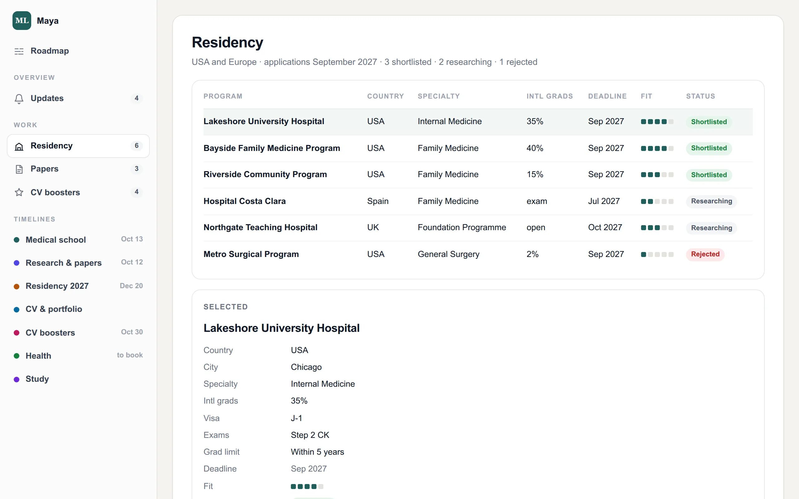
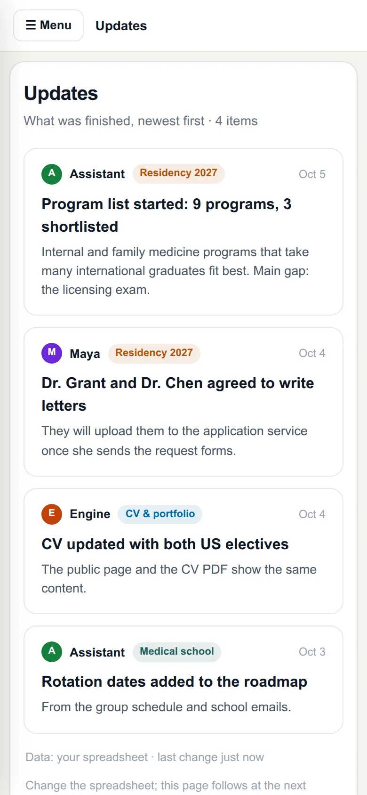
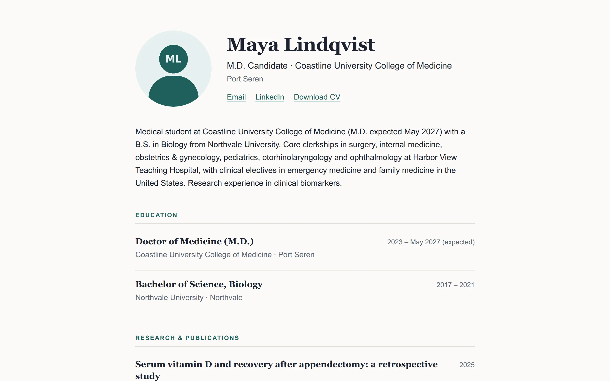

# Meet Maya

Maya Lindqvist is a medical student in her final year. She is **made up**: every name, school,
hospital and date in her setup is invented. But her setup is complete and real, and it is where
your agent starts when it designs yours.

Her year has a lot going on at once: clinical rotations with exams and assignments, two research
papers she wants published before applying, a list of residency programs to compare, electives
and certificates to strengthen her CV, letters from supervisors, and health check-ups she keeps
postponing.

## Her dashboard

Each part of her project is a **lane** on the roadmap: Medical school, Research & papers,
Residency 2027, CV, CV boosters, Health, Study. Inside each lane, **bars** are periods (a
rotation), **diamonds** are deadlines (an exam), and **tasks** are things to do. The cards at
the top count down to what matters next.

Lists she compares get their own pages. Residency programs are a **table** she can sort by fit,
deadline and status:

Her papers are **cards**, and an **update log** shows what got done, newest first. It works on a
phone too:

## Her public page and CV

From the same spreadsheet: a one-page site with her education, rotations, research and
certificates, and a CV as a PDF. Her phone number is only in her own copy of the CV, never on
the page or in the CV visitors can download.

## Try it

Open [life-crm.jerryfane.com](https://life-crm.jerryfane.com) and click around. In real life the
dashboard sits behind a login; Maya's is open because nothing in it is real.

> **For money or health:** the demo also has a money dashboard (car loan, emergency fund,
> bills, taxes) and a health dashboard (check-ups, lab results, a training plan). Same pieces,
> different lanes and pages.
