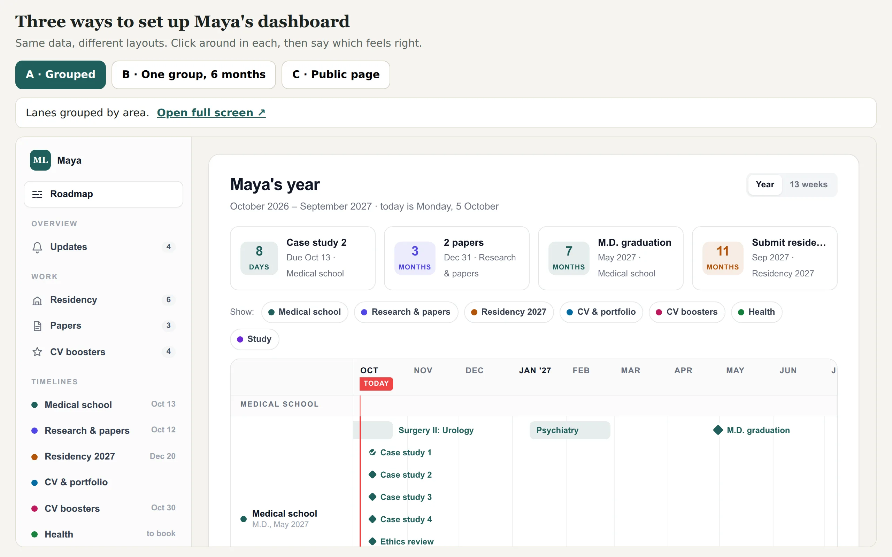

# Step 3: Choose

Most people cannot say what they want from a dashboard until they see two versions side by
side. So your agent does not describe designs: it builds three or four real ones and lets you
click through them.

> **Your agent does:** starts from Maya's setup and asks a few quick questions with options:
> which lanes, which lists deserve their own page, whether you want a public page, who else
> sees the dashboard. Then it builds 3-4 versions of your dashboard and one page to switch
> between them.

> **You do:** click around in each version, on your phone too if you will mostly use it there.
> Tell your agent which feels closest and what you would change. A second, smaller round
> usually settles it.

What the versions differ in, for example:

| Choice | Option A | Option B |
|---|---|---|
| Lanes | grouped by area | one lane per goal |
| A list | a table (compare many details) | cards (fewer, richer items) |
| Roadmap | 12 months (overview) | 6 months (detail) |
| Update log | yes | no |

The versions use your confirmed facts where they exist. Anything else is a clearly marked
sample row starting with "Example:". Maya's facts never end up in your sheet.

> **For money:** the choices are usually which lists get pages (bills, accounts,
> subscriptions) and whether amounts are shown.

> **For health:** usually whether results get their own page, and whether appointments sit in
> one lane or one lane per type (dentist, doctor, eyes).
